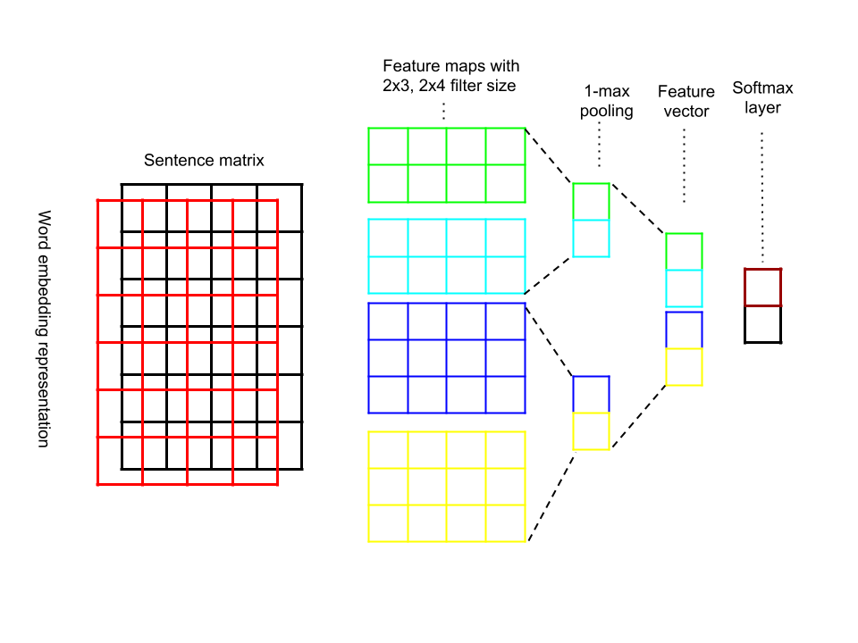
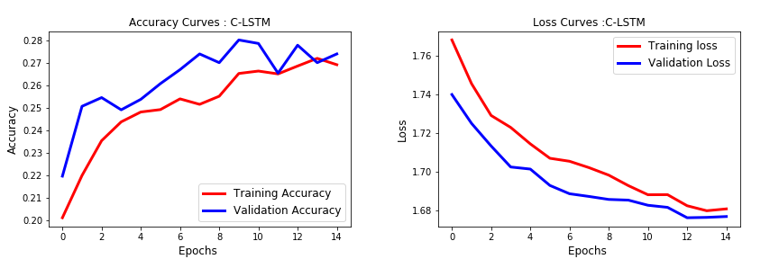
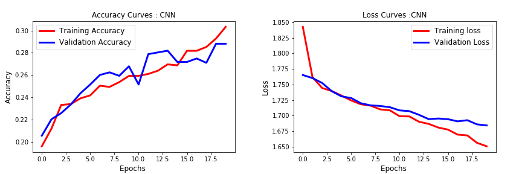

# Deep-Convolutional-Models-for-Fake-news-classification

Author: Jurat(Jerrat) Shayiding

Social media is a phenomenon that has recently expanded throughout high-speed internet. The extensive spread of fake news has a serious negative impacts on individuals and society. Thus, fake news detection on social media texts has recently become a pressing research topic to find effective solution to deter sprawling fake news. 

Discriminating fake news content from its legitimate counterpart present unique characteristics and challenges because fake news contents are always limited to short text for sharing information and opinions. However, statistical approaches to battle with fake news has been dramatically limited by the lack of labeled benchmark datasets. However, in this research project, we utilized the LIAR dataset with rich meta data to build a fake news classification model that outperformed the model mentioned in the paper [William Wang et al., 2017](https://arxiv.org/abs/1705.00648) where the accuracy of the proposed model is around 26% accuracy on the test set.

### Hybird CNN for fake news classification

In this research project, we aim to learn complementary linguistic features from fake news dataset in order to identify fake news content more efficiently from legitimate counterparts. In this project, we have introduced hybrid convolutional models including C-LSTM, CNN, RCNN model for identifying fake news. Our result shows that C-LSTM model rendered 28% accuracy which outperformed than baseline model. Here is breif summary of HybridCNN performance:

  > LSTM based model where news text was fed to the LSTM and the output was added to a condensed representation of the Meta Data (28% test  accuracy)
  > CNN based model with 128 filters each of size 2,5 and 8. Meta data was added in a condensed form just like the LSTM model (30% test accuracy)
  Extensively used Stochastic Gradient Descent and Tensorboard to visualize and develop intuition on convergence of these models. LSTM models tend to overfit easily. Dropout was used for regularization
  
### Hybrid CNN model Architecture

We are aiming to extract more discriminative linguistic features for fake news classification, and learning comlementary features from fake news contexts requires special convolutional neural network architecture. Here is the proposed Hybrid CNN model that we introduced in this study.

  
  ### Result

