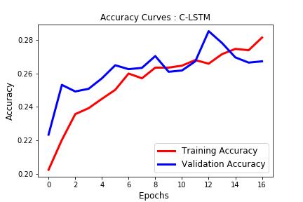

# Deep-Convolutional-Models-for-Fake-news-classification

Automatic fake news detection is a challenging problem in deception detection, and it has tremendous real-world political and social impacts. However, statistical approaches to battle with fake news has been dramatically limited by the lack of labeled benchmark datasets. However, in this research project, we utilized the LIAR dataset with rich meta data to build a fake news classification model that outperformed the model mentioned in the paper [William Wang et al., 2017](https://arxiv.org/abs/1705.00648) where the accuracy of the proposed model is around 27% accuracy on the test set.

### Hybird CNN for fake news classification

In this research project, we aim to learn complementary linguistic features from fake news dataset in order to identify fake news content more efficiently from legitimate counterparts. In this project, we have introduced hybrid convolutional models including C-LSTM, CNN, RCNN model for identifying fake news. Our result shows that C-LSTM model rendered 28% accuracy which outperformed than baseline model. Here is breif summary of HybridCNN performance:

  > LSTM based model where news text was fed to the LSTM and the output was added to a condensed representation of the Meta Data (28% test  accuracy)
  > CNN based model with 128 filters each of size 2,5 and 8. Meta data was added in a condensed form just like the LSTM model (30% test accuracy)
  Extensively used Stochastic Gradient Descent and Tensorboard to visualize and develop intuition on convergence of these models. LSTM models tend to overfit easily. Dropout was used for regularization
  
  ### Result

